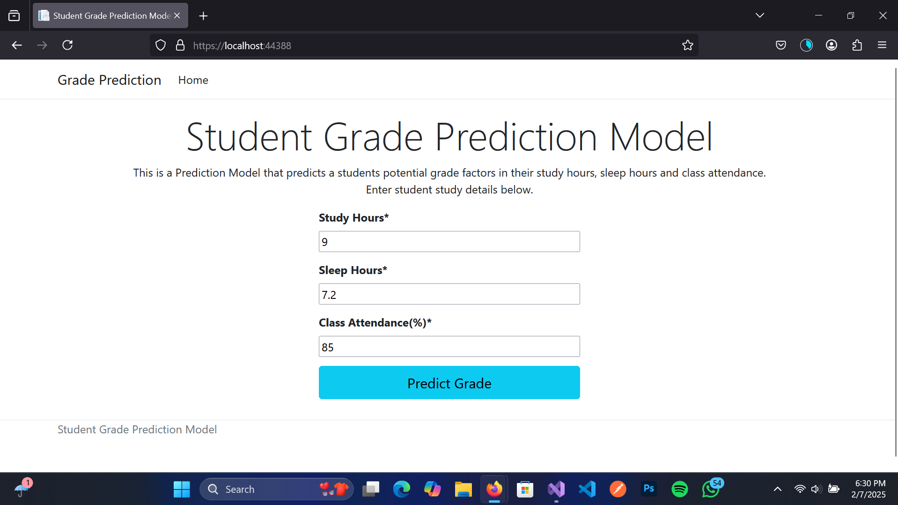

<h1>School Grades Prediction Model</h1>  
This is a simple frontend ASP.NET Core application with the purpose of demonstrating the consumption of a School Grades Machine Learning Model, that can predict an approximated potential grade that a student might take away after key features of their study are considered; such as their hours of study, hours of sleep and classroom attendance rate. I trained this model using a sample dataset that I found online.
  
I followed the essential procedure of eliminating features of the dataset that would be deemed non-essential to the training of the model, which is a part of data preparation. And then, with the help of Model Builder which uses AutoML underneath, that Microsoft provides in Visual Studio, I avoided the manual task of configuring a pipeline to add feature and label columns and selecting the right training algorithms myself, by simply choosing the right columns I need as features and labels, and allowing Model Builder to automatically cycle through several training algorithms, in order to choose the best one that fits my model.
  
The Prediction Model solves a prediction problem. Which is highly dependant on data that takes on a linear regression pattern. In training and evaluation the ideal model has to have an evaluation metric that leans closer to an R-Squared of 1.0, which is what the model had produced at the end of it's training. 
  
Below is an Illustration of how the model is used. The user enters the study hours, sleep hours and class room attendance rate after which they click on Predict Grade
  

  
And the prediction results are displayed on the next page.
  

